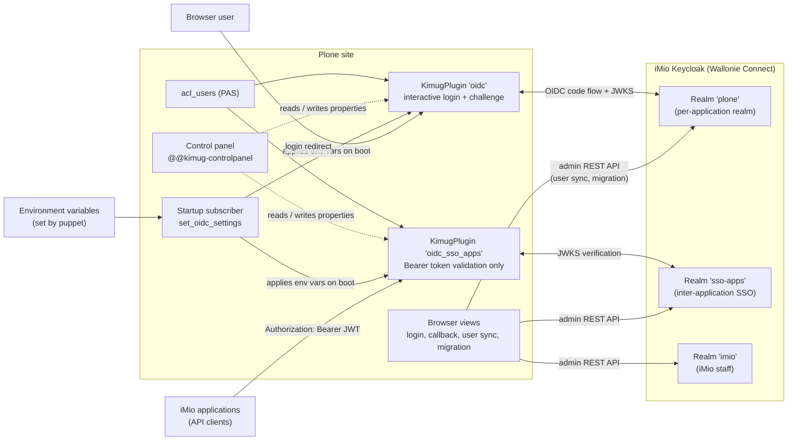
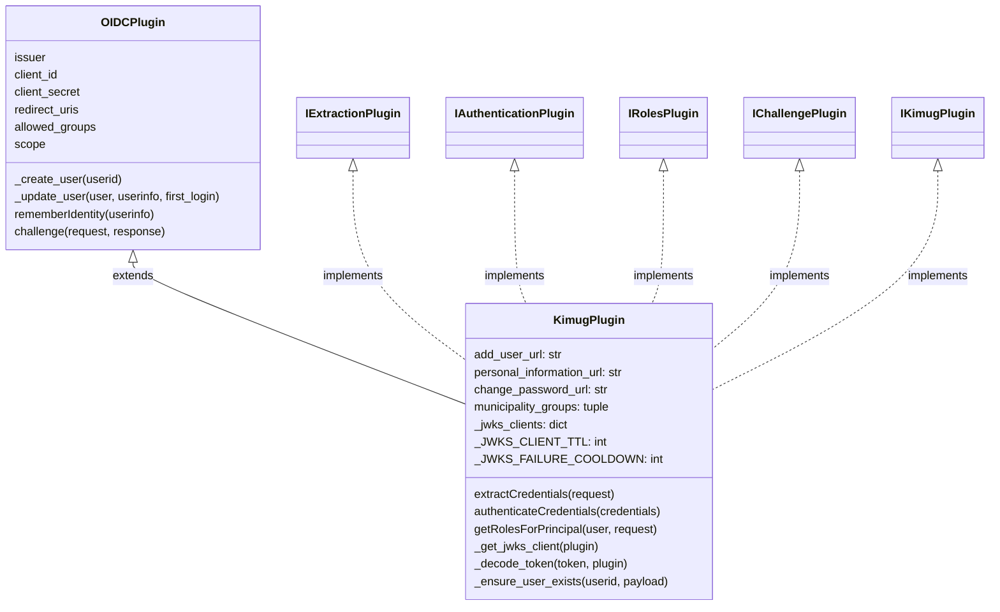
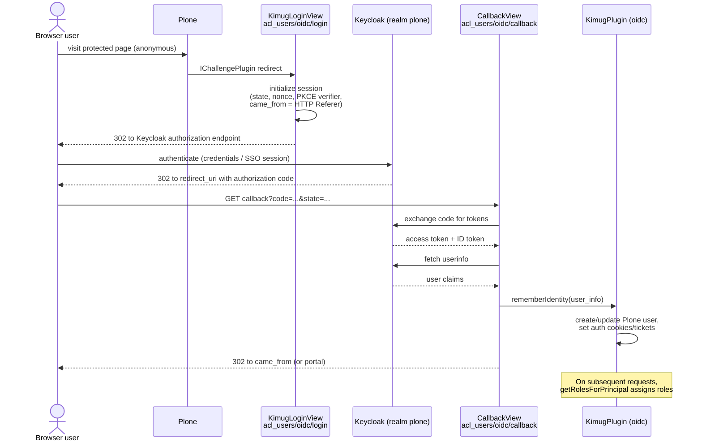
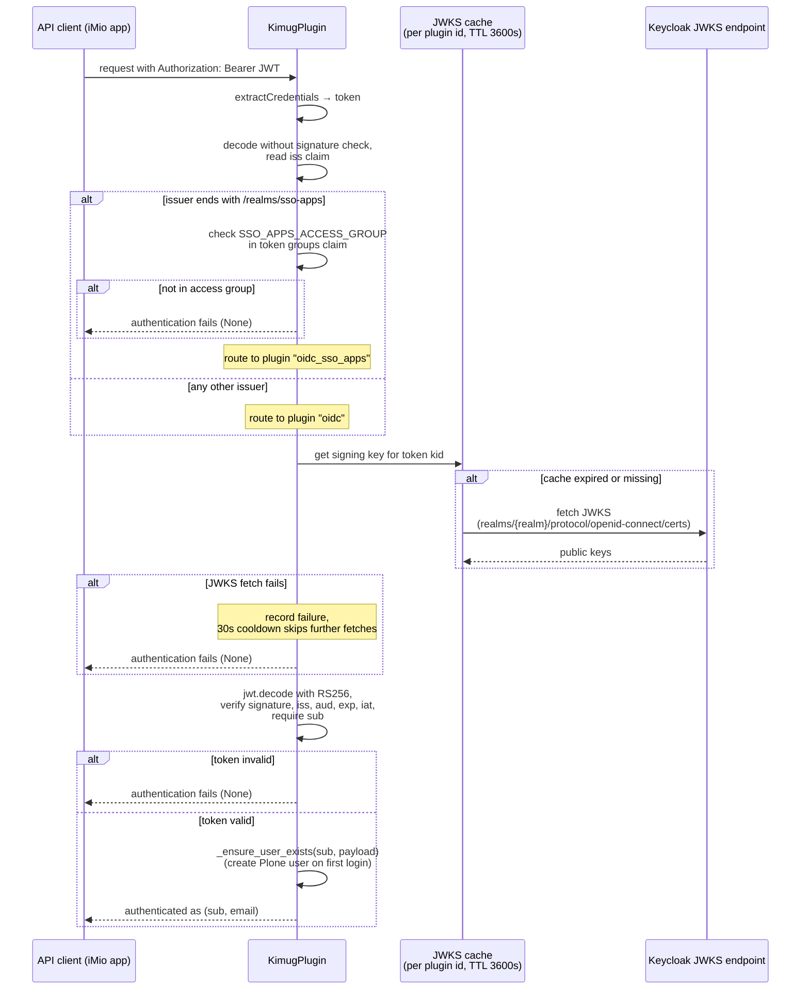
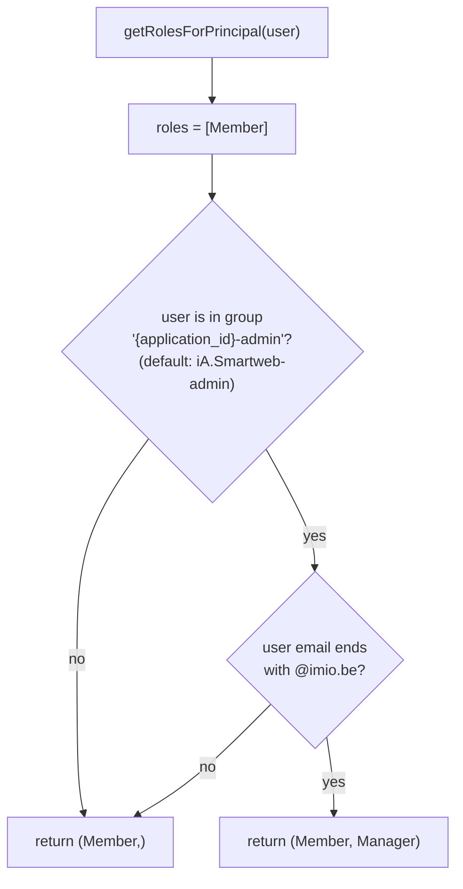
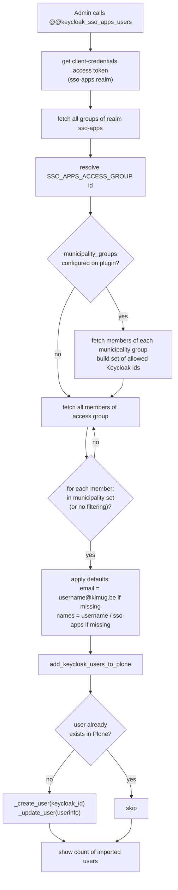
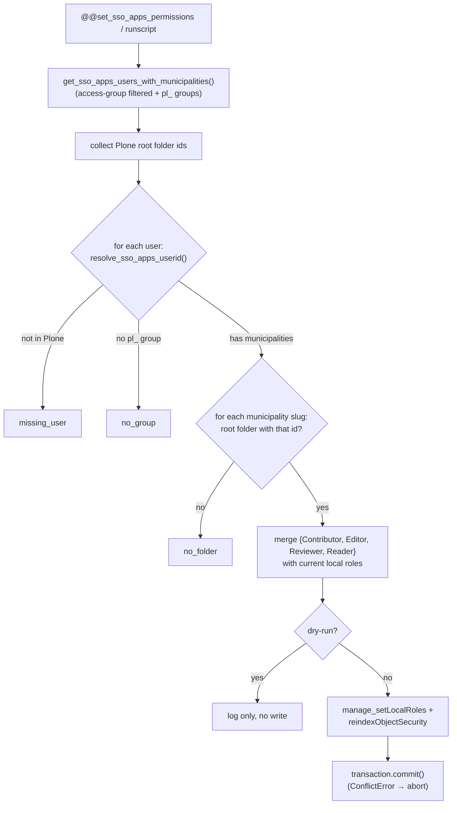
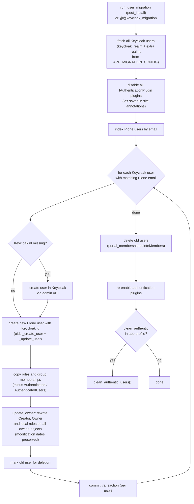

# pas.plugins.kimug — Documentation

A Plone PAS plugin that authenticates iMio Keycloak users and assigns them roles. It extends [`pas.plugins.oidc`](https://github.com/collective/pas.plugins.oidc) and is the bridge between Plone sites (e.g. iA.Smartweb) and the iMio Keycloak SSO ("Wallonie Connect").

## Table of contents

- [Overview](#overview)
- [Architecture](#architecture)
  - [Component diagram](#component-diagram)
  - [Class diagram](#class-diagram)
  - [Key modules](#key-modules)
- [Authentication flows](#authentication-flows)
  - [Interactive browser login](#interactive-browser-login)
  - [Bearer token authentication (API / SSO-apps)](#bearer-token-authentication-api--sso-apps)
  - [Role assignment](#role-assignment)
- [JWT verification and JWKS caching](#jwt-verification-and-jwks-caching)
- [User provisioning](#user-provisioning)
  - [Auto-creation on first Bearer login](#auto-creation-on-first-bearer-login)
  - [Bulk user sync from Keycloak groups](#bulk-user-sync-from-keycloak-groups)
  - [User migration](#user-migration)
- [Configuration](#configuration)
  - [Environment variables](#environment-variables)
  - [Startup subscriber](#startup-subscriber)
  - [Control panel](#control-panel)
- [Browser views](#browser-views)
- [Installation and GenericSetup](#installation-and-genericsetup)
- [Testing](#testing)

## Overview

`pas.plugins.kimug` installs **two instances** of the same `KimugPlugin` class in `acl_users`:

| Plugin id | Title | Purpose |
|---|---|---|
| `oidc` | OIDC | Interactive browser login through the main Keycloak realm (Authorization Code flow with PKCE). Handles the `IChallengePlugin` redirect to Keycloak. |
| `oidc_sso_apps` | OIDC SSO Apps | Stateless Bearer-token validation for machine-to-machine calls from other iMio applications (the `sso-apps` realm). Its `IChallengePlugin` interface is deliberately **deactivated** so it never hijacks the interactive login. |

Key responsibilities:

- **Extraction** — pull `Authorization: Bearer <JWT>` tokens from requests (RFC 6750).
- **Authentication** — fully verify the JWT (RS256 signature against Keycloak's JWKS, issuer, audience, expiry) and route it to the right plugin based on the token's issuer.
- **Roles** — every Keycloak user gets `Member`; users in the `{application_id}-admin` group with an `@imio.be` email also get `Manager`. Plugin-created users are additionally granted the global `Kimug Authenticated Users` role, which holds the `plone.restapi: Access Plone vocabularies` permission.
- **Challenge** — unauthenticated browser users are redirected to the Keycloak login page.
- **Provisioning** — auto-create Plone users on first Bearer login, bulk-import users from Keycloak groups, and migrate legacy Plone user ids to Keycloak ids.
- **Configuration** — all settings are read from environment variables at Zope startup and applied to the plugins, with a Plone control panel for inspection and overrides.

**Package facts** (from `setup.py`): version `1.8.1.dev0`, license GPLv2, Python 3.10–3.13, Plone 6.0/6.1. Dependencies: `pas.plugins.oidc>=2.0.0b4`, `python-keycloak`, `PyJWT[crypto]>=2.6`, `plone.api`, `Products.CMFPlone`.

## Architecture

### Component diagram



### Class diagram



`OIDCPlugin` comes from `pas.plugins.oidc`; the `I*` classes are the PAS plugin interfaces (`IKimugPlugin` is the package's own marker interface).

### Key modules

| Path (under `src/pas/plugins/kimug/`) | Purpose |
|---|---|
| `plugin/__init__.py` | `KimugPlugin` class: token extraction, JWT verification, JWKS caching, role assignment, user auto-creation |
| `utils.py` | Keycloak admin REST API integration, user sync/migration (`run_user_migration`, per-app `APP_MIGRATION_CONFIG`), `set_sso_apps_local_roles` (municipality local-role assignment), `set_oidc_settings` startup configuration, settings validation, legacy `authentic`/`pas.plugins.imio` cleanup |
| `browser/view.py` | Login/callback views and admin views (migration, user sync, SSO-apps local roles, debug toggle, Keycloak-hosted redirects) |
| `scripts/set_sso_apps_permissions.py` | Standalone `bin/instance run` runscript wrapping `set_sso_apps_local_roles` (supports `--dry-run`) |
| `controlpanel/classic.py` | Control panel adapter and forms for both plugin instances |
| `interfaces.py` | `IBrowserLayer`, `IKimugPlugin`, `IKimugSettings`, `IKimugSSOAppsSettings` |
| `setuphandlers/__init__.py` | `post_install` handler: creates both plugins, applies settings, runs the app-agnostic user migration (`run_user_migration`) |
| `subscribers/configure.zcml` | Registers `set_oidc_settings` on `IDatabaseOpenedWithRoot` (Zope startup) |
| `upgrades/` | GenericSetup upgrade steps (profile versions 1000 → 1007) |
| `profiles/default/` | GenericSetup profile (registry, control panel, browser layer, rolemap), version 1007 |

## Authentication flows

### Interactive browser login

A browser user logging into Plone is redirected to Keycloak through the standard OIDC Authorization Code flow. Two views on the `oidc` plugin drive this: `KimugLoginView` (`@@login`) and `CallbackView` (`@@callback`), both in `browser/view.py`.

Notable kimug specifics compared to the stock `pas.plugins.oidc` views:

- `came_from` is taken from the **HTTP Referer** header instead of a query-string parameter, so the user returns to the page they were on.
- The session stores `state`, `nonce` and (when PKCE is enabled) a 128-character `verifier`.



### Bearer token authentication (API / SSO-apps)

Any request carrying an `Authorization: Bearer <JWT>` header is authenticated statelessly. The plugin first decodes the token **without verifying the signature**, solely to read the `iss` claim and decide which plugin configuration (realm) applies; the actual verification then happens in `_decode_token` with full signature and claims validation.

For tokens issued by the `sso-apps` realm, the user must additionally belong to the access group given by `SSO_APPS_ACCESS_GROUP` (default `access_imio-apps-kimug`), read from the token's `groups` claim.



### Role assignment

`getRolesForPrincipal` (the `IRolesPlugin` implementation) runs for every authenticated user:



The application id comes from the `application_id` environment variable (default `iA.Smartweb`), so the admin group is e.g. `iA.Smartweb-admin`. The `@imio.be` email restriction ensures only iMio staff can obtain `Manager` through Keycloak group membership.

## JWT verification and JWKS caching

`_decode_token` in `plugin/__init__.py` is the security-critical path. It validates, per plugin instance:

| Check | `oidc` plugin | `oidc_sso_apps` plugin |
|---|---|---|
| Algorithm | RS256 only | RS256 only |
| Signature | against JWKS of realm `keycloak_realm` | against JWKS of realm `SSO_APPS_REALM` |
| `iss` | `keycloak_issuer` env var | derived from `SSO_APPS_URL` + `SSO_APPS_REALM` |
| `aud` | `keycloak_audience` (default `account`) | `SSO_APPS_AUDIENCE` → `SSO_APPS_CLIENT_ID` → `imio-apps-plone` |
| Required claims | `exp`, `iat`, `sub` | `exp`, `iat`, `sub` |

Failure behaviour is deliberately graceful: any verification error returns `None` so the PAS chain falls through to other authentication plugins, instead of raising an HTTP 500.

**JWKS client caching** (two mechanisms, both class-level on `KimugPlugin`):

- **Per-plugin client cache** — one `PyJWKClient` per plugin id (`oidc` / `oidc_sso_apps`), rebuilt after `_JWKS_CLIENT_TTL` (3600 s) so Keycloak key rotations are picked up without a restart. A single shared client would alternate between realms whose tokens never match the cached keyset, forcing a JWKS refetch on every request.
- **Failure cooldown** — after a failed JWKS fetch, further fetches for that plugin are skipped for `_JWKS_FAILURE_COOLDOWN` (30 s). PyJWT clears its keyset cache on every failed fetch, so without this backoff a transient 403 from the Keycloak proxy becomes a self-sustaining retry storm.
- **Explicit User-Agent** — each `PyJWKClient` is built with a `User-Agent: pas.plugins.kimug` header (`_JWKS_USER_AGENT`). PyJWT defaults to `Python-urllib/<ver>`, which the production Keycloak WAF rejects with `403 Forbidden`, silently breaking Bearer-token verification. Staging and test have no such WAF rule, which is why the test suite never reproduced it; any non-urllib UA passes.

## User provisioning

### Auto-creation on first Bearer login

When a verified token belongs to a user that does not yet exist in Plone, `_ensure_user_exists` creates one from the **OIDC claims** in the JWT (`preferred_username`, `email`, `given_name`, `family_name`, `sub`), with defaults for missing fields:

- missing email → `{username}@kimug.be`
- missing first and last name → first name = username, last name = `sso-apps`

The newly created user is then granted the global `Kimug Authenticated Users` role (`KIMUG_AUTHENTICATED_ROLE`). This grant runs in its own try/except, so a failure there never blocks user creation or login.

Creation failures are logged but never block authentication.

### Bulk user sync from Keycloak groups

Two admin views (manager permission required) import users in bulk through the Keycloak admin REST API:

- **`@@keycloak_users`** — imports members of the groups listed in the `oidc` plugin's `allowed_groups` property (realm `keycloak_realm`).
- **`@@keycloak_sso_apps_users`** — imports members of the `SSO_APPS_ACCESS_GROUP` group of the `sso-apps` realm, optionally filtered by **municipality groups** (since v1.6.4).

Municipality filtering restricts the SSO-apps sync to users belonging to at least one organisation-specific group (e.g. `pl_belleville_ac`). The list is stored as the `municipality_groups` property on the `oidc_sso_apps` plugin, set from the `SSO_APPS_MUNICIPALITY_GROUPS` environment variable at startup and editable in the control panel. An empty list means no filtering.



### SSO-apps local roles on municipality folders

`set_sso_apps_local_roles` (in `utils.py`, triggered by `@@set_sso_apps_permissions` or the `scripts/set_sso_apps_permissions.py` runscript) grants SSO-apps users `Contributor`, `Editor`, `Reviewer` and `Reader` **local roles** on the Plone root folder of each municipality they belong to.

Municipalities are derived from the user's Keycloak groups, which follow the `pl_<municipality>-<type>` convention (`_municipality_from_group_name`). The municipality is the segment between the `pl_` prefix and the first hyphen, so the AC and CPAS variants of an organisation collapse to one slug — e.g. `pl_amay-ac` and `pl_amay-cpas` both map to `amay`. A Plone root object whose id matches the slug exactly receives the local roles.

The operation is **idempotent**: existing local roles are merged with the new set (never overwritten), so re-running is safe. A `dry-run` mode reports what would change without writing anything or committing. The summary dict it returns (and logs) has the buckets:

- `granted` — `(username, userid, municipality)` triples that received the roles;
- `no_group` — users with no `pl_` group;
- `no_folder` — `(username, municipality)` pairs whose slug has no matching root folder;
- `missing_user` — users present in Keycloak (and in the access group) but absent from Plone.



The runscript is a thin shim so it can be dropped unchanged into every instance that needs it:

```bash
bin/instance -O Plone run scripts/set_sso_apps_permissions.py
bin/instance -O Plone run scripts/set_sso_apps_permissions.py --dry-run
```

### User migration

`run_user_migration` (in `utils.py`, called by `post_install`) migrates legacy Plone accounts so their user id becomes the Keycloak id. The migration is **app-agnostic**: the `application_id` environment variable selects a per-app profile in `APP_MIGRATION_CONFIG` that decides which extra Keycloak realms to fetch users from (besides the primary `keycloak_realm`) and whether to clean up the legacy `authentic` plugin afterwards:

| `application_id` | Extra realms fetched | `authentic` cleanup |
|---|---|---|
| `iA.Smartweb` (default) | `imio` | yes |
| `iA.Bibliotheca` | – | no |
| any other value | – | no |

`run_user_migration` aborts early when a required environment variable is missing (`varenvs_exist`, which includes `application_id`) or when the primary realm does not answer (`realm_exists`). The `@@keycloak_migration` view runs the same core migration (`get_keycloak_users` + `migrate_plone_user_id_to_keycloak_user_id`) without those guards and without the `authentic` cleanup — `get_keycloak_users` itself honours the app profile's extra realms in both paths.

`migrate_plone_user_id_to_keycloak_user_id` matches users **by email**; everything attached to the old account follows the new id:



Authentication plugins are disabled during the migration to prevent conflicts, and re-enabled in a `finally` block even if the migration fails. The final `authentic` cleanup only runs through `run_user_migration`, and only for apps whose profile enables it.

## Configuration

### Environment variables

All configuration is environment-driven (set by puppet in production) and applied at startup by `set_oidc_settings`. List-valued variables use the puppet-rendered bracket format: `[group1, group2]` (a single bare value also works).

**`oidc` plugin (interactive login):**

| Variable | Default | Purpose |
|---|---|---|
| `keycloak_url` | `https://keycloak.127.0.0.1.nip.io/` | Keycloak base URL (JWKS, admin API) |
| `keycloak_realm` | `plone` | Realm for login and JWKS |
| `keycloak_client_id` | `plone` | OIDC client id |
| `keycloak_client_secret` | `12345678910` | OIDC client secret |
| `keycloak_issuer` | `https://keycloak.127.0.0.1.nip.io/realms/{realm}` | Expected `iss` claim and OIDC discovery base |
| `keycloak_audience` | `account` | Expected `aud` claim for Bearer tokens |
| `keycloak_allowed_groups` | – | Groups allowed to log in / be synced, bracket format |
| `keycloak_add_user_url` | `http://localhost/wca/` | Redirect target of `@@new-user` |
| `keycloak_personal_information_url` | `http://localhost/wca/profile/` | Redirect target of `@@personal-information` |
| `keycloak_change_password_url` | `http://localhost/wca/change_password/` | Redirect target of `@@change-password` |
| `keycloak_admin_user` / `keycloak_admin_password` | – | Master-realm admin credentials (migration, full user fetch) |
| `WEBSITE_HOSTNAME` | – | Builds the redirect URI: `https://{hostname}/acl_users/oidc/callback` (fallback `http://localhost:8080/Plone/...`) |
| `application_id` | `iA.Smartweb` | Admin group prefix for the `Manager` role (`{application_id}-admin`); also selects the per-app migration profile (`APP_MIGRATION_CONFIG`) and is required (`varenvs_exist`) for the install-time migration to run |
| `KIMUG_LOG` | `false` | When not `true`, debug logging registry record is forced off at startup |

**`oidc_sso_apps` plugin (Bearer tokens from other iMio apps):**

| Variable | Default | Purpose |
|---|---|---|
| `SSO_APPS_URL` | `https://keycloak.127.0.0.1.nip.io/realms/sso-apps` | SSO-apps issuer URL (scheme+host also used for JWKS) |
| `SSO_APPS_REALM` | `sso-apps` | Realm for JWKS and issuer derivation |
| `SSO_APPS_CLIENT_ID` | `imio-apps-plone` | Client id (also audience fallback) |
| `SSO_APPS_CLIENT_SECRET` | `imio-apps-plone-client-secret` | Client secret (admin API access for sync) |
| `SSO_APPS_AUDIENCE` | `SSO_APPS_CLIENT_ID` value | Expected `aud` claim |
| `SSO_APPS_ACCESS_GROUP` | `access_imio-apps-kimug` | Keycloak group required to authenticate via sso-apps tokens |
| `SSO_APPS_MUNICIPALITY_GROUPS` | – (unset = no filtering) | Bracket-format list restricting the SSO-apps user sync to members of these municipality groups |

### Startup subscriber

`subscribers/configure.zcml` registers `utils.set_oidc_settings` on `zope.processlifetime.IDatabaseOpenedWithRoot`, so every Zope instance applies the environment configuration at boot:

- sets `redirect_uris`, `client_id`, `client_secret`, `issuer`, `scope = (openid, profile, email)`, `userinfo_endpoint_method = GET` and the three Keycloak-hosted URLs on the `oidc` plugin;
- sets `plone.external_login_url` / `plone.external_logout_url` registry records to `acl_users/oidc/login|logout`;
- parses `keycloak_allowed_groups` and `SSO_APPS_MUNICIPALITY_GROUPS` into the corresponding plugin properties (unset variables leave properties unchanged);
- configures the `oidc_sso_apps` plugin (client id/secret, issuer — no redirect URIs, since it only validates tokens);
- commits, and on `ConflictError` (several instances booting simultaneously and writing the same values) aborts and logs instead of crashing.

The same logic can be re-applied at any time through the `@@set_oidc_settings` view.

### Control panel

`@@kimug-controlpanel` (registered in `controlpanel/`) renders two forms on one page:

- **OIDC settings** (`IKimugSettings`, plugin `oidc`) — issuer, client id/secret, redirect URIs, scope, allowed groups, the three Keycloak-hosted URLs, userinfo endpoint method. Low-level OIDC toggles (PKCE, ticket creation, …) are intentionally hidden.
- **SSO-apps settings** (`IKimugSSOAppsSettings`, plugin `oidc_sso_apps`) — issuer, client id/secret, municipality groups.

The `KimugControlPanelAdapter` reads and writes the values directly as properties of the corresponding plugin instance (no registry storage).

Action buttons (CSRF-protected with `plone.protect` authenticator tokens):

- **Check settings** — `check_keycloak_settings(plugin)` requests a client-credentials token from Keycloak with the stored settings and, for `oidc`, verifies the configured redirect URIs against the Keycloak client; the result is shown as a success/danger alert.
- **Import users** — triggers `@@keycloak_users` / `@@keycloak_sso_apps_users`.
- **Set sso-apps users local roles on their municipality folder** — triggers `@@set_sso_apps_permissions`; a second button runs it in `dry-run` mode (report only, no changes).
- **Toggle debug mode** — flips the `pas.plugins.kimug.log` registry record (`@@toggle_debug_mode`); when active, the plugin logs every extraction/verification/role decision.

## Browser views

All views live in `browser/view.py` and are registered in `browser/configure.zcml` for the `IBrowserLayer`.

| View | Context | Permission | Purpose |
|---|---|---|---|
| `@@login` | `oidc` plugin | View | Starts the OIDC authorization flow (session init, redirect to Keycloak) |
| `@@callback` | `oidc` plugin | View | Handles the authorization response, calls `rememberIdentity`, redirects to `came_from` |
| `@@logout`, `@@require_login`, `@@backchannel-logout` | `oidc` plugin | View | Reused from `pas.plugins.oidc` |
| `@@keycloak_migration` | site root | Manage portal | Runs the legacy-user → Keycloak-id migration |
| `@@set_oidc_settings` | site root | Manage portal | Re-applies environment configuration |
| `@@keycloak_users` | site root | Manage portal | Bulk-imports users from `allowed_groups` |
| `@@keycloak_sso_apps_users` | site root | Manage portal | Bulk-imports SSO-apps users (with municipality filtering) |
| `@@set_sso_apps_permissions` | site root | Manage portal | Grants SSO-apps users local roles on their municipality folder (accepts `dry-run`) |
| `@@toggle_debug_mode` | site root | Manage portal | Toggles `pas.plugins.kimug.log` |
| `@@new-user` | navigation root | Users and Groups | Redirects to `add_user_url` (Keycloak-hosted registration) |
| `@@personal-information` | navigation root | Set own properties | Redirects to `personal_information_url` |
| `@@change-password` | navigation root | Set own properties | Redirects to `change_password_url` |

The last three override the Plone defaults: user management happens in Keycloak (Wallonie Connect), not locally. The `@@usergroup-userprefs` control panel template is also overridden.

## Installation and GenericSetup

The package is auto-discovered by Plone via `z3c.autoinclude`. Installing the `pas.plugins.kimug:default` profile triggers `setuphandlers.post_install`, which:

1. creates the `oidc` plugin (all PAS interfaces activated, moved to the end of each interface list);
2. creates the `oidc_sso_apps` plugin with `challenge=False` (its `IChallengePlugin` activation is removed so interactive logins stay on `oidc`);
3. runs `set_oidc_settings`;
4. runs the app-agnostic user migration (`run_user_migration`): if all required environment variables are present (`varenvs_exist`, including `application_id`) and the realm answers (`realm_exists`), fetches users from the primary realm plus the app profile's extra realms, runs the email-keyed user-id migration, and cleans up legacy `authentic` users (`clean_authentic_users`) only when the profile enables it (currently `iA.Smartweb`).

Profile version is **1007**. Upgrade history:

| Step | Action |
|---|---|
| 1000 → 1001 | Remove legacy `authentic` users |
| 1001 → 1002 | Add the kimug control panel |
| 1002 → 1003 | Add the `oidc_sso_apps` plugin and sync its users |
| 1003 → 1004 | Register the `pas.plugins.kimug.log` debug registry record |
| 1004 → 1005 | Deactivate `IChallengePlugin` on `oidc_sso_apps` so `oidc` handles interactive login |
| 1005 → 1006 | Remove `pas.plugins.imio` and the legacy `authentic` PAS plugin (`remove_pas_plugins_imio` → `remove_authentic_plugin`: runs the `pas.plugins.imio:uninstall` profile, deletes the `authentic` plugin, resets login/logout URLs to OIDC) |
| 1006 → 1007 | Register the `Kimug Authenticated Users` role and grant it the `plone.restapi: Access Plone vocabularies` permission (rolemap profile `upgrade_1006_to_1007`), then grant the role to existing plugin-created users — those with an `@kimug.be` email (`grant_kimug_authenticated_role`) |

## Testing

Tests run against a real Keycloak started by **pytest-docker** from `tests/docker-compose.yml`: Keycloak + PostgreSQL behind a Traefik reverse proxy, reachable at `https://keycloak.127.0.0.1.nip.io/`. Every realm file in `tests/keycloak/import/` is imported at startup (`--import-realm`): `plone`, `imio` and `sso-apps`, plus five dummy `municipality1`…`municipality5` realms (each with an `imio` identity provider and a handful of dummy users) for local multi-municipality testing. The identity-provider link alias is `imio`, matching the staging/production naming convention.

```bash
.venv/bin/pytest tests -s              # run the test suite
make test                              # same via tox (tox -e test)
tox -e test -- -k test_name            # single test
tox -e coverage                        # with coverage report
```

Key fixtures in `tests/conftest.py`:

- `keycloak_service` — waits for the JWKS endpoint to answer (up to 120 s) before tests start;
- `keycloak` — issuer, client id/secret and redirect URLs for the `plone` realm client;
- `keycloak_api` — admin API credentials;
- `portal` — integration portal with the plugins installed and configured.

Test credentials: master admin `admin`/`admin`; OIDC user `kimug`/`kimug` (`kimug@imio.be`); SSO-apps user `imio-apps-plone_belleville-ac`.

Plone test layers (`testing.py`): `INTEGRATION_TESTING`, `FUNCTIONAL_TESTING`, `ACCEPTANCE_TESTING` built on `PloneSandboxLayer` + `PLONE_APP_CONTENTTYPES_FIXTURE`, with pytest-plone fixtures.
